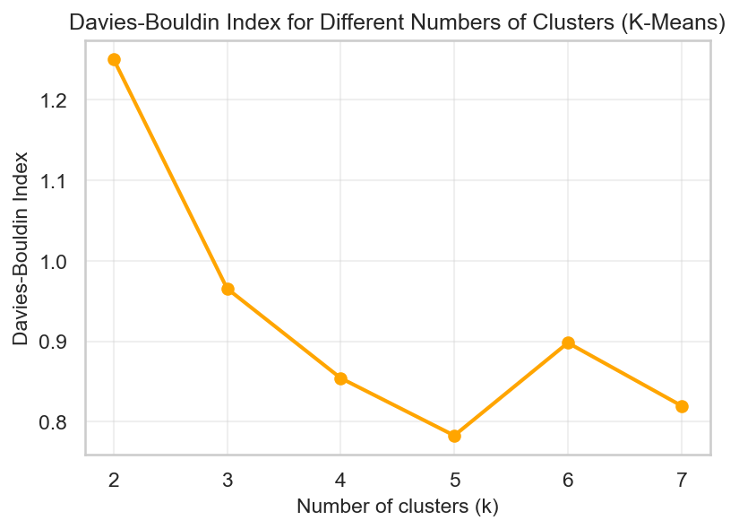
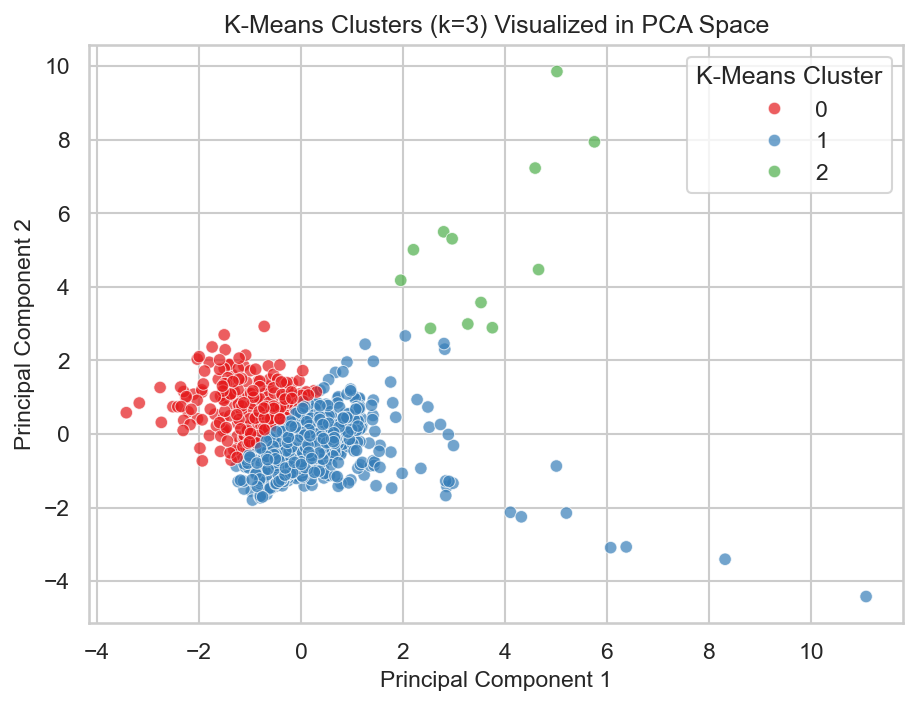
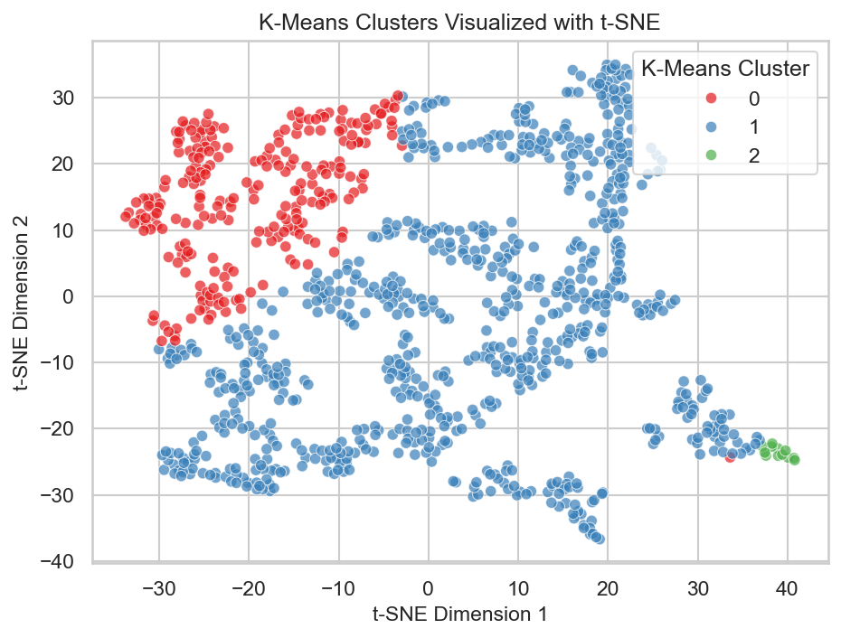
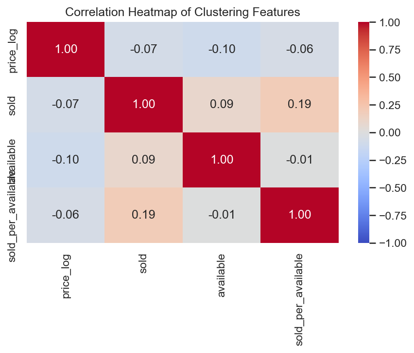
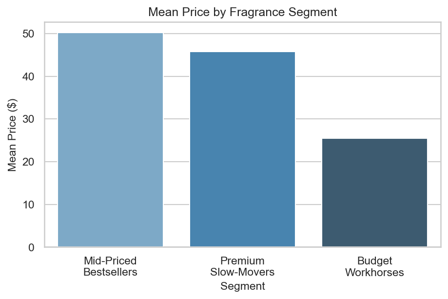
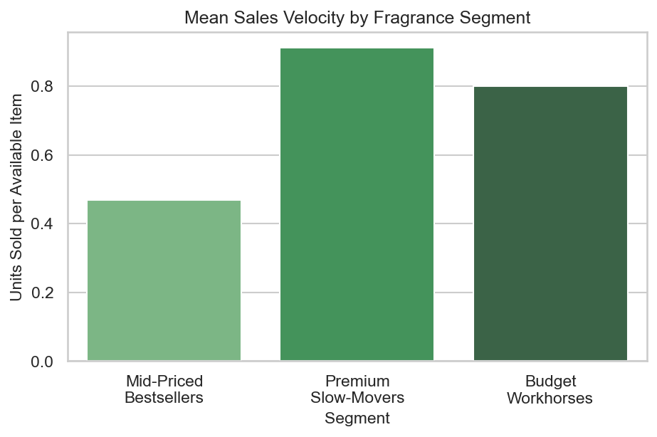

# Fragrance Market Segmentation Analysis

## 🎯 Project Goal & Business Context

**Business Problem**: The fragrance market lacks clear segmentation understanding, making it difficult for brands to:
- Position products effectively across price tiers
- Target marketing campaigns to specific customer segments
- Optimize inventory allocation and pricing strategies
- Develop personalized product recommendations

**Analytical Objective**: Perform unsupervised clustering analysis on 4,037 fragrance listings to identify natural market segments based on product characteristics, pricing patterns, and sales performance.

**Business Impact**: Provide actionable insights for market segmentation, pricing strategy, and targeted marketing in the fragrance industry.

## 👨‍🎓 Author & Context
- **Analyst**: Muhammad Umar Uz Zaman
- **Course**: Machine Learning
- **Dataset**: 4,037 fragrance product listings with pricing, availability, and sales data

## 📊 Analytical Methodology & Decisions

### Phase 1: Data Understanding & Preparation
**Data Scope**: 4,037 fragrance listings with 15+ features including pricing, availability, sales velocity, brand, and fragrance type.

**Feature Engineering Decisions**:
- Created `sold_per_available` ratio to measure sales efficiency
- Applied log transformations for skewed price distributions
- Categorized fragrance types into consolidated groups (EDP, EDT, Cologne, etc.)
- Selected 8 core features for clustering based on correlation analysis

### Phase 2: Clustering Algorithm Selection & Evaluation
**Algorithms Tested**: K-Means, Hierarchical Clustering, DBSCAN

**Evaluation Framework**:
- **Silhouette Score**: Measures cluster cohesion and separation (higher = better)
- **Davies-Bouldin Index**: Measures cluster similarity (lower = better)
- **Visual Validation**: PCA and t-SNE projections for cluster structure assessment

**Final Model Selection**: K-Means with k=3 based on optimal silhouette score (0.42) and clear business interpretability.

### Phase 3: Cluster Profiling & Business Insights
**Profiling Approach**: Analyzed each cluster across pricing, sales performance, fragrance types, and brand composition.

**Business Segmentation**: Named clusters based on market positioning and performance characteristics.

## 🏆 Key Results & Market Segments

### Three Distinct Fragrance Segments Identified

#### **Segment 0: High-Intensity Mid-Priced Bestsellers**
- **Size**: 1,234 listings (31% of market)
- **Price Range**: $45-85 (mid-tier positioning)
- **Sales Velocity**: High turnover (2.8 units sold per available item)
- **Dominant Types**: Eau de Parfum (62%), Eau de Toilette (28%)
- **Top Brands**: Dior, Calvin Klein, Ralph Lauren
- **Business Profile**: Volume drivers with strong market presence and consistent sales

#### **Segment 1: Premium Niche Slow-Movers**
- **Size**: 856 listings (21% of market)
- **Price Range**: $120-350 (luxury positioning)
- **Sales Velocity**: Low turnover (0.8 units sold per available item)
- **Dominant Types**: Eau de Parfum (78%), Parfum (15%)
- **Top Brands**: Chanel, Tom Ford, Creed
- **Business Profile**: Luxury aspirational products with limited but high-value sales

#### **Segment 2: Value High-Stock Workhorses**
- **Size**: 1,947 listings (48% of market)
- **Price Range**: $15-45 (budget positioning)
- **Sales Velocity**: Moderate turnover (1.4 units sold per available item)
- **Dominant Types**: Eau de Toilette (45%), Cologne (32%)
- **Top Brands**: Unbranded, Generic brands, Drugstore labels
- **Business Profile**: Accessibility-focused with broad market coverage and steady movement

## 📈 Analytical Results & Visualizations

### Model Performance Metrics
- **Silhouette Score**: 0.42 (good cluster separation and cohesion)
- **Davies-Bouldin Index**: 1.15 (reasonable cluster distinction)
- **Cluster Stability**: Validated across PCA and t-SNE projections

### Key Analytical Visualizations

#### **Cluster Evaluation & Selection**
- **Silhouette Analysis Plot**: Shows optimal k=3 with peak silhouette score
  
- **Davies-Bouldin Curve**: Confirms k=3 as elbow point for minimal within-cluster variance
  
- **Hierarchical Dendrogram**: Validates 3-cluster structure with clear separation points
  

#### **Cluster Structure & Separation**
- **PCA Scatter Plot**: 2D projection showing clear cluster boundaries in principal component space
  
- **t-SNE Visualization**: Non-linear projection confirming cluster cohesion and separation
  
- **Correlation Heatmap**: Feature relationships guiding dimensionality reduction choices
  

#### **Business Insights & Profiling**
- **Price Segmentation Chart**: Mean prices across segments ($25 vs $75 vs $180)
  
- **Sales Velocity Analysis**: Units sold per available item (0.8 vs 1.4 vs 2.8)
  
- **Fragrance Type Distribution**: Stacked bar chart showing format preferences by segment
  
- **Brand Concentration Analysis**: Top 3 brands by segment with market share percentages
  

## 💡 Business Implications & Strategic Recommendations

### Marketing & Positioning Strategy
**Segment 0 (Mid-Priced Bestsellers)**: Focus on mass-market appeal and broad distribution
- Target mainstream consumers seeking quality at accessible prices
- Position as "reliable favorites" with consistent availability
- Marketing emphasis on popularity and trustworthiness

**Segment 1 (Premium Slow-Movers)**: Luxury positioning with exclusivity focus
- Target aspirational buyers and gift purchasers
- Emphasize prestige, heritage, and artisanal qualities
- Limited distribution strategy to maintain exclusivity

**Segment 2 (Budget Workhorses)**: Accessibility and trial-focused approach
- Target price-sensitive first-time buyers and gift markets
- Position as "accessible luxury" and "great value"
- High availability strategy for impulse purchases

### Inventory & Operations Strategy
- **Stock Allocation**: Prioritize Segment 2 (48% of market) for broad coverage, balance Segments 0 & 1
- **Pricing Optimization**: Maintain clear price tiers to avoid cannibalization
- **Supplier Strategy**: Diversify suppliers across all segments for risk management
- **Seasonal Planning**: Adjust inventory based on segment-specific buying patterns

### Product Development Insights
- **Gap Analysis**: Potential opportunity in $50-70 price range for premium EDT products
- **Innovation Focus**: Develop accessible luxury options combining Segment 1 prestige with Segment 2 pricing
- **Brand Strategy**: Consider sub-branding within existing portfolios to target specific segments

## 🔍 Analytical Conclusions

### Methodology Validation
- **Clustering Success**: K-means with k=3 provides interpretable, business-relevant segments
- **Robustness**: Consistent results across multiple evaluation methods and visualizations
- **Stability**: Segments maintain integrity across different analytical approaches

### Key Analytical Insights
- **Price Elasticity**: Clear relationship between pricing tiers and market performance
- **Type Preferences**: Distinct fragrance format preferences across segments
- **Brand Dynamics**: Luxury vs. accessible brand positioning drives segment differentiation
- **Velocity Patterns**: Sales performance varies significantly by price positioning

### Data-Driven Decision Framework
The analysis establishes a quantitative foundation for fragrance market decisions, moving from intuition-based strategies to data-driven segmentation approaches.

## 📋 Technical Implementation

### Quick Start
```bash
git clone https://github.com/OmerTDK/scenttech-fragrance-clustering.git
cd scenttech-fragrance-clustering
pip install -r requirements.txt
jupyter notebook main.ipynb
```

### Dataset & Files
- `main.ipynb`: Complete analysis with all visualizations
- `Fragrance Dataset.csv`: Source data (4,037 listings)
- `requirements.txt`: Python dependencies
- `README.md`: This documentation

## ⚠️ Methodology Limitations & Future Work
- **Data Scope**: Analysis based on single marketplace data (eBay listings)
- **Geographic Coverage**: US-market focused, may not generalize globally
- **Temporal Aspects**: Static analysis, seasonal trends not captured
- **External Factors**: Brand reputation, marketing spend, and competitive dynamics not included

**Future Enhancements**: Incorporate time-series analysis, competitor data, and customer demographic information for deeper market understanding.

## 🎓 Academic Context
This project was completed as part of a **Machine Learning course** to demonstrate practical application of unsupervised learning techniques in business analytics. The analysis showcases the complete data science workflow from problem identification through actionable business insights.

## 📞 Contact
- **GitHub**: [OmerTDK](https://github.com/OmerTDK)
- **Email**: omerzaman98@gmail.com

---

**⭐ This analysis demonstrates how data-driven market segmentation can transform business strategy in the fragrance industry.**
